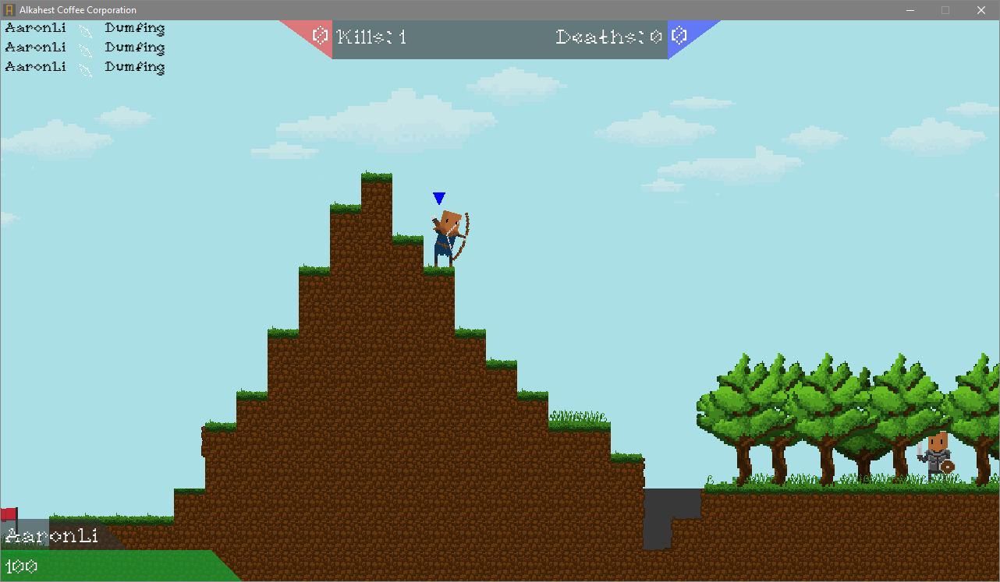
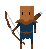
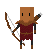
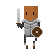
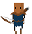
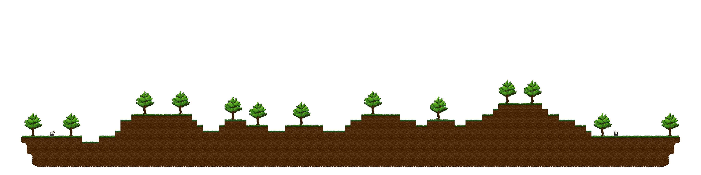
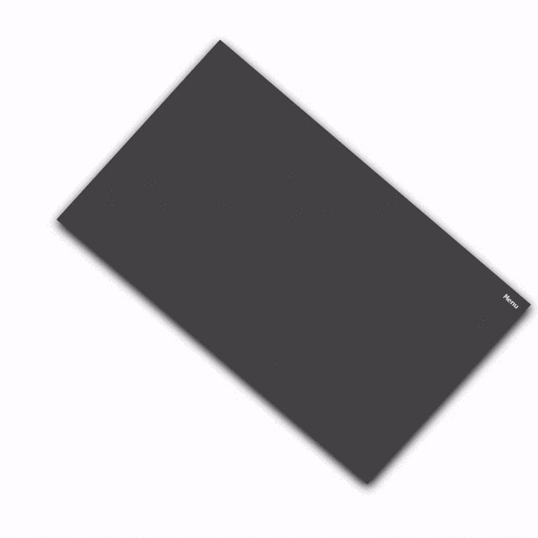

# AlkahestCoffee
A 2D network multiplayer PVP game using LibGDX for graphics and Kryonet for networking.



##Features

- 2 different classes with their own team colours
    -  
    -  
    - Full Animations for all classes
        - 
        - 
- Custom Level
    - 
- 7000 lines of Java!
- Custom Menu Library for easy UI manipulation


## Challenges


- Learning the Libraries
  - When I first started this project, I had little to no guidance on how to use both Kryonet and LibGDX (the backbones of this project)
I had to figure out best practices for using these libraries as well as how I will use these libraries together to create my multiplayer game.
I learned ways of using LibGDX that would allow my game to easily grow in size as I add more features and I also spent time figuring out how
to make a menu system that would allow me to create new menus more quickly and easily as I finished more parts of the game.
- Collaboration
  - During the early stages of development my partner and I quickly realised our java libraries were unlinked whenever we updated our projects,
  this was due to how LibGDX handles its files with Gradle. The directories that lead to these libraries would vary by system and so productive workload
  would cease as we were relinking files. The final solution I came up with was to move the files out of the gradle storage location and bring them along with
  the project to allow the game to be opened on any IntelliJ system without having to clone my systems exact filesystem layout

#### LibGDX files
```
These files can be found in
core/assets/javalibs/gdxJars
if you've already run gdx-setup.jar on your system, the files should be located in %userprofile%\.gradle\caches

gdx-1.9.5.jar // newer versions of LibGDX exist now
gdx-backend-lwjgl-1.9.5.jar
gdx-platform-1.9.5-natives-desktop.jar
gdx-tools-1.9.5.jar //not required for LibGDX to run but contains many useful tools for particles and spritesheets

//lwjgl files
//I haven't verified whether any of these files are truly required
jinput-2.0.5.jar
jinput-platform-2.0.5-natives-linux.jar
jinput-platform-2.0.5-natives-osx.jar
jinput-platform-2.0.5-natives-windows.jar
jlayer-1.0.1-gdx.jar
jorbis-0.0.17.jar
jutils-1.0.0.jar
lwjgl-2.9.2.jar
lwjgl-platform-2.9.2-natives-linux.jar
lwjgl-platform-2.9.2-natives-osx.jar
lwjgl-platform-2.9.2-natives-windows.jar
lwjgl_util-2.9.2.jar

//Kryonet
kryonet-2.21-all.jar
```